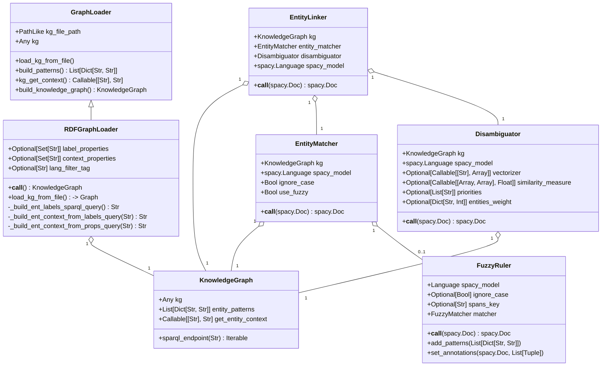

## Buzz EL project dev notes

### Project specifications



## Some notes about the project philosophy:

The project relies on the spaCy NLP python library and aims at being integrated into a spaCy project.

At minimum the entity linker should be provided as a spaCy pipe.

### Knowledge Graph

The graph is loaded with a Graph Loader into a Knowledge Graph class.
Different graph loaders can be implemented to match different formats.

The Knowledge Graph class must provide all methods needed by other components to interact with the graph.

### Entity Linker

The Entity Linker should:

- without any parameters other than the KG, build a minimum entity linker based on string matching.
- apply the components in the right order (Matcher then Disambiguator)

The goal is to make the Entity Linker a spaCy pipe.

### Entity Matcher

The entity matcher should extract mentions and assign them candidate entities.

The different entity matching methods can be executed in parallel. They are then stored separately so they can be use during the disambiguation part.

Keys to save spans on the doc.spans dictionary based on the matching type:

- string: base entity matching process relying on exact string alignment. It is based on the spaCy span ruler component.
- fuzzy: entity matching based on fuzzy string matching. It relies on the spaczz project.
- vector: entity matching based on string vector similarities.

### Disambiguator

The disambiguator should select one entity for each mention. It can use different strategies:

- vector voter: base the entity selection on the vector similarities.
- majority voter: base the entity selection on the different matching types votes.
- priority voter: base the entity selection on the defined matching types priorities.
- popularity voter: base the entity selection on the given entity weights.

## Code

### Coding style

- [Google Python Style Guide](https://google.github.io/styleguide/pyguide.html)

- [Numpy docstrings style](https://www.sphinx-doc.org/en/master/usage/extensions/napoleon.html)

### Test

Every development must be tested.
The tests are launched with the `pytest` command.

As we want to be an open source library, we must have a test coverage percentage close to 100%.
The following command should be used to evaluate:

```Bash
pytest --cov-report term-missing --cov=. test
```

### Git best practices

- Main branch must always be functional
- When developing a new feature, a new branch named "feat/{feature_name}" must be created
- When fixing an issue, a new branch named "fix/{feature_name}" must be created and linked to the issue
- Create a merge/pull request to submit the code

Start new developments

```Bash
git pull
git checkout -b {new_branch}
```

Submit new developments

```Bash
git add {files}
git commit -m "{comment}"
git push {origin} {new_branch}
```

Amend commit and push after a review

```Bash
git checkout {branch_to_be_merged}
git add {modified_files}
git commit --amend
git push --force-with-lease {origin} {branch_to_be_merged}
```

Update the code after an amend commit

```
git checkout {branch_to_be_merged}
git fetch
git reset --hard {origin}/{branch_to_be_merged}
```

### Virtual environment

Setting up the virtual environment:

- go to the project root directory: `buzz-el/`
- create the virtual environment by running `virtualenv -p python3.10 {env/path}` (virtualenv needs to be installed) or `python3 -m venv {env/path}`. As a result, you should have a new folder at your project root.
- activate the virtual environment by running
  - `source {env/path}/bin/activate` on Linux
  - `{env/path}\Scripts\activate` on Windows
- check that the environment is properly installed by running the test from the project root directory with the command line `pytest test`.

Setting up project dependencies :

- install the project dependencies by running `pip install -r requirements.txt` (from within the virtual environment)
- update the requirements after new downloads by running `pip freeze > requirements.txt`

### Building the package

The project is not yet pushed on Pypi, but it is already setup to be loaded with `pip install`.

To pip install the project as a Python package you can:

- Pip install the package directly from GitHub: `pip install git+https://github.com/schmarion/buzz-el.git`
- Pip install the package directly from GitHub and from a specific branch: `pip install git+https://github.com/schmarion/buzz-el.git@the_branch_name`
- Clone the GitHub project and pip install the package locally: `pip install -e .` from the project root. This the preferred development method as pip will update automatically any changes made locally.
